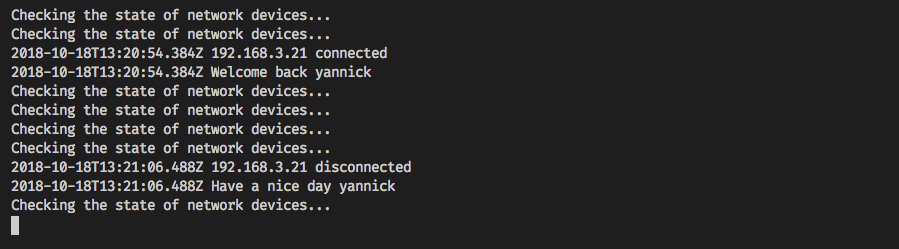

# fritz-devices

Small script which polls the connected network devices from the FritzBox.
Can be used for presence detection, based on if the mobile phone is connected to the Wi-Fi.

## Tested
* FritzBox 4040 v07.01

## Material
* Inspiration: https://www.kuketz-blog.de/fritzbox-wlan-toggle-per-skript/
* documentation [AVM_Technical_Note_-_Session_ID PDF](https://avm.de/fileadmin/user_upload/Global/Service/Schnittstellen/AVM_Technical_Note_-_Session_ID.pdf)
